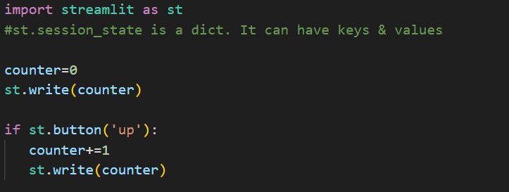
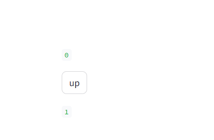

# CRUD_Operations
 https://sayanteka-crud-operations-app-uawzae.streamlit.app/

If I keep on clicking up button, it reruns and the concept of counter doesn't work. It just prints 0 and 1.
So we have to store that in session state i.e. outside rerun block. So counter var will be a key in session state

# Diff between monolithic and microservices.

Suppose airbnb app has 3 components auth, payment, listings. problem with monolithic, if i change anything in authentication i need to redeploy again all units. Thus I have scaling issue. can't scale up indiviadual component. has to scale up every components. If I have developed any of the components with java then it has to be java for other components as well. advantage: Easier to develop and manage. 

Benefit of micro: Independent Deployment. Scaling up Benefit.

# Azure webapp deployment
cpu cores will commonly handle an avg of 220 to 250 users. 2 cpu cores=500 visitors.
Faster Ram faster processing speed.

# single tenant plus multi tenant.
single tenant apps are available in where they are registered. multi-tenant are available to users in both their home and other tenants.
For company users, tenant=company name. To add any individual add in azure active directory.
# apache kafka

https://www.youtube.com/watch?v=KerNf0NANMo
kafka=real time data processing
prodcer-kafkaserver-consumer

#single tenant vs multiple tenant

